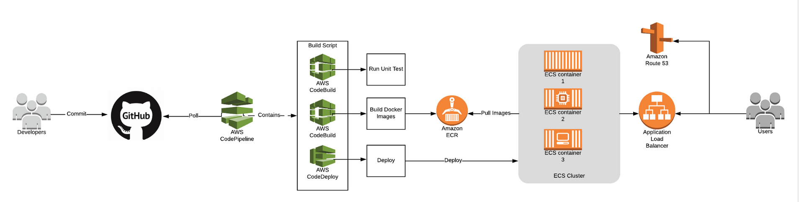

# whls_cicd_pipeline

# AWS上CI/CD Pipeline的搭建

------


## 简介
本架构基于AWS的CI/CD服务，演示了如何使用Terraform在AWS上创建基础架构资源，并通过CodePipeline和CodeBuild将应用程序连续部署到Elastic Container Service（ECS）上。通过持续集成/部署，软件的修订版会被自动部署到生产环境，而无需开发人员的手工操作，从而使整个软件发布过程实现自动化。

## 架构说明


1.	整套环境通过Terraform自动化部署，只需要在Terraform variables.tfvars文件中填入AWS access key, AWS secret key, github repo信息、github_oauth_token等个人信息及其他自定义资源信息即可创建出NAT Gateway, Network, VPC, Subnet, ECR, ECS cluster, CodeBuild, CodePipeline, IAM roles等相关基础架构资源与服务；

2.	开发者在Git仓库中commit代码，当源代码有任何改变时将触发CodePipeline自动拉取源代码并打包存储在S3中；

3.	CodePipeline拉取源码后，会利用CodeBuild进行单元测试，在单元测试通过后打包成docker镜像并推送到ECR中；

4.	CodePipeline最后一个阶段中，CodeBuild会执行部署脚本deploy.sh，产生ECS任务定义将应用部署至ECS cluster中；

5.	ECS集群预定义了一系列的由任务（容器配置）组成的服务定义。ECS调用最新的修订版，按照给定的集群设定逐步更新容器集群，并且将新的容器注册到负载均衡器上，注销旧的容器。负载均衡器可以监视并自动替换掉不健康的容器；

## 文件结构
### Terraform code
* /terraform
### 演示源代码
* /web/

```
web/
├── app.py			#应用源代码
├── buildspec.yml		#构建规范
├── deploy.sh			#部署脚本
├── docker-compose.yml		#用于应用部署
├── Dockerfile			#用于构建镜像
├── requirements.txt		#用于构建镜像
├── service.json		#ECS服务定义
├── task.json			#ECS任务定义
└── test_basic.py		#单元测试脚本

```

## Terraform variables.tfvars 文件模板
For example: I want to create a VPC with CIDR ( 10.0.0.0/16 ), two public subnet and two private subnet.

```
aws_access_key = "Your AWS IAM user access key"
aws_secret_key = "Your AWS IAM user secret key"
vpc_cidr = "10.0.0.0/16"
environment = "production"
public_subnet_cidrs = ["10.0.0.0/24", "10.0.1.0/24"]
private_subnet_cidrs = ["10.0.50.0/24", "10.0.51.0/24"]
availibility_zones = ["us-west-2a", "us-west-2b"]
region = "us-west-2"
ami_image = "ami-043c4e6bff652b99e"
ecs_key = "Your key pair"
instance_type = "t2.micro"
repo_owner = "whls"
repo_name = "whls_cicd_pipeline"
github_oauth_token = "Your github_oauth_token"

```

## 执行语句
```
terraform init
terraform plan -var-file=variables.tfvars
terraform apply -var-file=variables.tfvars
```

## 输出内容

```
Apply complete! Resources: 36 added, 0 changed, 0 destroyed.
Outputs:
url = flask-app-*********.us-west-2.elb.amazonaws.com
通过url访问应用.

```


